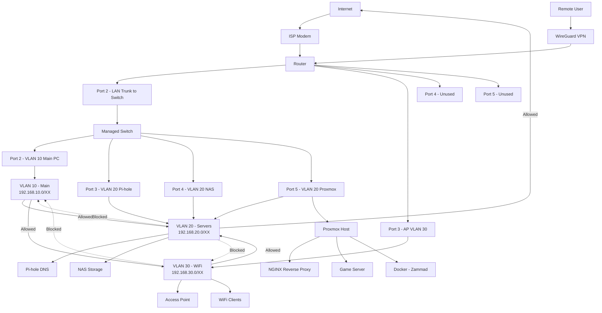

Network Infrastructure and Segmentation

Designed and implemented a segmented home network using a custom router, managed switch, and wireless access points.

Key Features:
+ Configured VLANs for network segmentation:
  - Main network
  - Server network
  - Wi-Fi network
+ Implemented VLAN tagging across network devices
+ Applied ACLs to control inter-VLAN communication
+ Improved network security and isolation

Skills Demonstrated:
+ Network design and architecture
+ VLAN configuration and tagging
+ Access Control Lists (ACLs)
+ Router and switch configuration

## Overview

> Note: This diagram is a simplified representation of the home lab network. Sensitive details such as public IPs, domain names, and access configurations are intentionally omitted for security.

